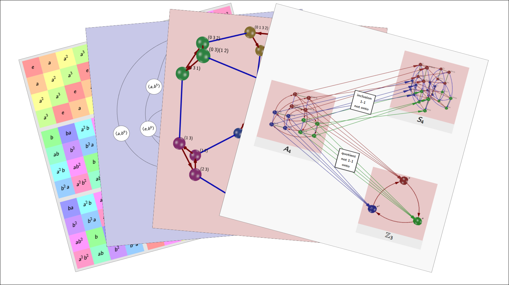

# Group Explorer 3.7rc15

*Group Explorer* is interactive visualization software for abstract algebra — specifically finite group theory. It runs entirely in the browser, requires no installation, and is designed for students and instructors building intuition about groups and their structure.

[Try it live.](https://nathancarter.github.io/group-explorer/)



## What you can do

**Explore the group library.** The built-in library contains all groups of order 1–20 and a selection of larger groups, displayed with thumbnail visualizations. An extended library adds all non-Abelian groups of order <= 40, for more advanced study. You can also define your own groups from a presentation and use them anywhere a library group can be used.

**Visualize any group four ways.** Each group can be displayed as a Cayley diagram, multiplication table, cycle graph, or object of symmetry — all interactive, zoomable, and highlightable by subgroup or coset.

**Show relationships between groups on a Sheet.** A Sheet is a free-form canvas where you can place multiple visualizations side by side and draw morphisms between them. Arrows are colored by source or destination highlighting, making it easy to see how structure maps through a homomorphism. Sheets can be saved, exported, and shared.

## Running locally

No build step required. Serve the repository root over HTTP:

```bash
python3 -m http.server 8080
# then open http://localhost:8080/GroupExplorer.html
```

## Release notes

**3.7.0**
- User-defined groups: define a group by generators and relations; stored locally and usable everywhere a library group can be used
- Extended library: larger and more exotic groups available via the page menu
- Morphism arrows colored by source/destination highlighting
- Subgroup lattice on Group Info page includes descriptive captions and compacted layout by conjugacy class
- Improved default Cayley diagram layouts, more representative of group structure
- Cayley diagram: snap-to-axis and coordinate axis display (View tab)
- Sheet backup/restore; stored sheets list with load, export, and rename
- Control panel swipe-to-hide on visualizer pages
- Hamburger menu replaces icon strip in page headers
- Groups stored in IndexedDB (no more localStorage size limits)
- jQuery removed from production code

**3.6.1:** Fix error in normalizer calculation

**3.6.0:** Upgrade to jQuery 3.6.1, three.js r146

**3.4.0:** Multiplication table option to keep element colors fixed on reorganization

**3.3.0:** Group Info page improvements; internal refactoring

**3.2.0:** Sheets page with stored sheet support

**3.0.0:** First full-featured web release

## Contributing

The app is pure JavaScript (ES6 modules, no build step). If you'd like to contribute or report a bug, open an issue or pull request on GitHub.

If you'd like a specific group added to the library, it's straightforward to export from GAP — get in touch.

## Contributors

 * Ray Ellis — developed most of the web version
 * Nathan Carter — developed the original version; added sheets; authored the built-in help system

## License

[LGPL v3.0](https://www.gnu.org/licenses/lgpl-3.0.en.html)
