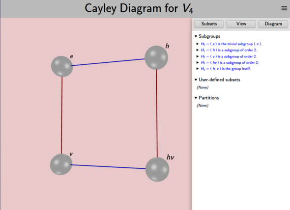

## What is a "large visualizer?"

Each [visualizer](rf-geterms.md#visualizers) in *Group Explorer* can show up
in three contexts: in a [group info page](rf-um-groupwindow.md), as an item
in a [sheet](rf-geterms.md#sheets), or in full detail in its own editable
window. This last case is the subject of this page.

Because each visualizer is different, this page covers just what all large
visualizer views have in common, and refers you to each visualizer's
individual interface page for specific information about each.

## Opening a large visualizer

You can obtain a large view of each visualizer one of two ways.

1.  Some pages contain links that will create a large visualizer for you.

    For instance, each [group info page](rf-um-groupwindow.md)
    has a Views section that gives a preview of every visualizer
    for the group and clicking any one opens a large copy
    in its own window. Thumbnails of each visualizer on
    [the main application page](rf-um-mainwindow.md) work the same way.

    In this case, once you close the window, all your changes are lost.

2.  You can create visualizers in [sheets](rf-geterms.md#sheets)
    and open a large version by selecting **Edit** from the element's context
    menu (right-click or tap-and-hold).

    In this case, the large view is linked to the small view in the sheet,
    and all changes made to the large view in its own window
    are reflected in the image on the sheet
    and will be saved if you save the sheet.

Here is a screenshot of a window viewing a large version of a Cayley
diagram.

## Page structure

Every large visualizer page is split into two halves, like the one shown
above. The left half will always have the picture — the visualization. The
right half will be controls that allow you to edit the picture. You
can hide the right half by dragging it to the right;
if it's hidden, drag from the right edge of the screen to expose it again.

If you perform any of the edits described with the controls below but then
wish to undo them and reset the large visualizer to its original state, just
reload the page in your browser. Any changes you have made will be lost.

## Page Menu

In the upper right-hand corner of every page you will find a menu icon

with the following options:

#### Group Info

Takes you to the [Group Info page](rf-um-groupwindow.md), where
you can see all the information *Group Explorer* has about the group.

#### Group Library

Takes you to the [Group Library](rf-um-mainwindow.md), the main page of the app.

#### New Sheet

Opens a blank sheet, into which you can insert visualizations of any groups
from the library and connect them with morphisms. To read more on sheets, see
[the sheets tutorial](tu-sheets.md) or [the sheets reference](rf-um-sheetwindow.md).

#### Settings

Opens the Settings dialog, where you can control which groups appear in the
library. See [the Group Library page](rf-um-mainwindow.md#settings) for details.

#### Help

Opens the help page specific to the visualizer you have open:

*   [Cayley diagram interface](rf-um-cd-options.md)
*   [Multiplication table interface](rf-um-mt-options.md)
*   [Cycle graph interface](rf-um-cg-options.md)
*   [Symmetry object interface](rf-um-os-options.md)

There are some controls shared by several visualizers; their documentation
is here:

*   [Subset options controls](rf-um-subsetlistbox.md)
*   [Controls for viewing 3D models](rf-um-modelview.md)

#### About GE3

Displays version information and links to the project website and source
repository.
