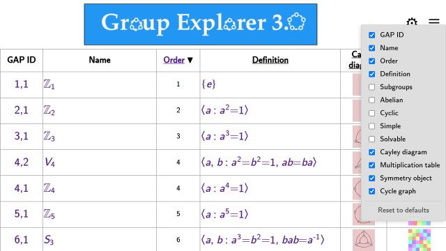
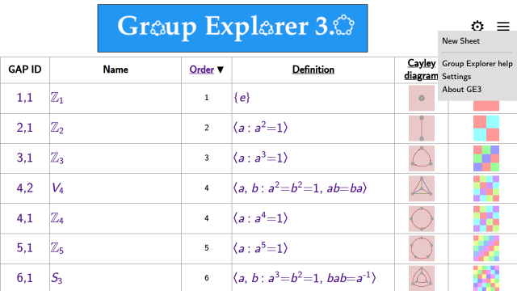
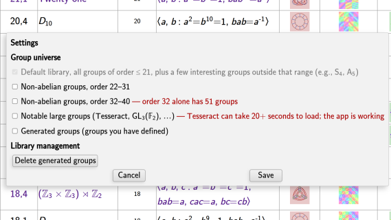

This page documents the main window of the *Group Explorer* web application,
from which all other pages are opened.

## The group table

Each row in the table represents a group in the library. By default the
following columns are shown:

1. **GAP ID** — the group's ID in the [GAP computer algebra system](rf-um-gap.md)
2. **Name** — the symbolic name of the group
3. [**Order**](rf-groupterms.md#order-of-a-group) — the number of elements in the group
4. [**Definition**](rf-groupterms.md#definition-of-a-group-via-generators-and-relations) — a presentation of the group by generators and relations
5. [**Cayley diagram**](rf-groupterms.md#cayley-diagrams)
6. [**Multiplication table**](rf-groupterms.md#multiplication-table)
7. [**Object of symmetry**](rf-groupterms.md#objects-of-symmetry)
8. [**Cycle graph**](rf-groupterms.md#cycle-graph)

Clicking any thumbnail opens the corresponding visualizer. Clicking a group's
name or GAP ID opens its [Group Info page](rf-um-groupwindow.md), which is
the main launchpad for exploring the group.

On touch devices, tap a row once to highlight it and see a description; tap
again to open the page.

The first time you visit the *Group Explorer* main page it may take a moment
to load all the groups in the library. Future visits are faster because the
application stores the library in your browser.

## Configuring the columns

Click the **⚙** icon in the upper right of the page heading to open the
column configuration panel. In addition to the default columns above, the
following computed columns are available:

- **Subgroups** — total number of subgroups
- [**Abelian**](rf-groupterms.md#abelian-group) — whether the group is abelian
- [**Cyclic**](rf-groupterms.md#cyclic-group) — whether the group is cyclic
- [**Simple**](rf-groupterms.md#simple-group) — whether the group is simple
- [**Solvable**](rf-groupterms.md#solvable-group-solvable-decomposition) — whether the group is solvable

Your column choices and sort order are saved automatically and restored the
next time you open *Group Explorer*. Use **Reset to defaults** at the bottom
of the panel to restore the original column set.

## Sorting the table

Click any column heading to sort by that column; click again to reverse the
sort order. Note that some column headings are also links to help pages —
clicking the link text navigates to help rather than sorting; click elsewhere
in the heading cell to sort.

## Page heading

The page heading contains two icons on the right:

- **⚙** — opens the column configuration panel (described above)
- **≡** — opens the page menu

The page menu contains:

#### New Sheet

Opens a blank sheet for building diagrams that connect multiple groups with
morphisms. See [the sheets tutorial](tu-sheets.md) or [the sheets
reference](rf-um-sheetwindow.md).

#### Group Explorer help

Opens this help system.

#### Settings

Opens the Settings dialog, where you can control which groups appear in the
library:

- **Non-abelian groups, order 22–31** — an extended collection of larger groups
- **Non-abelian groups, order 32–40** — a further extension (order 32 alone
  contains 51 groups)
- **Notable large groups** — selected larger groups of special mathematical
  interest. Be aware that the Tesseract group is computationally demanding:
  its row takes about 5 seconds to appear in the Group Library, its Group Info
  page takes around 15 seconds to render, and expanding the Subgroups section
  can take 20 seconds or more as all its generated subgroups are computed. The
  app is working during this time — it has not crashed. The wait is rewarded:
  the Tesseract's Cayley diagram is one of the most complex and beautiful
  structures in the library.
- **Generated groups** — groups you have defined yourself

Groups take up very little space — the entire default library is smaller than
a typical photograph — so there is no need to manage storage. The **Delete
generated groups** button is there if you want a clean slate; any deleted
group can always be recreated.

#### About GE3

Displays version information and links to the project website and source
repository.
