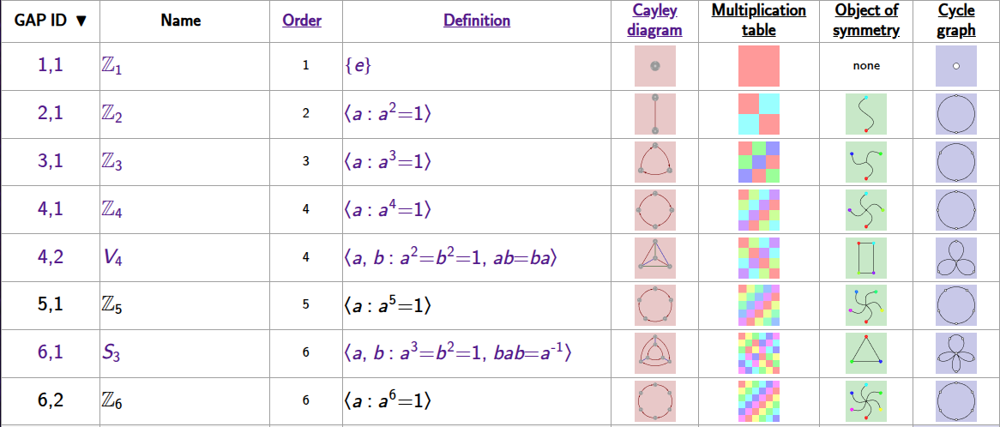
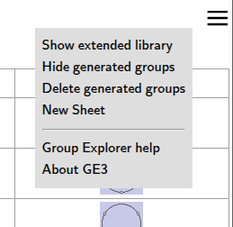

This page documents the main window of the *Group Explorer* web application
and from which all other page are opened.

## Data in the group table

Each row in the table shown in the main *Group Explorer* page represents a
group. By default, the following columns are visible (in this order) when
*Group Explorer* has opened:

1.  GAP Id -- the small group ID of the group in [GAP](rf-um-gap.md)
2.  Name - the symbolic name of the group, as shown above
3.  [Order](rf-groupterms.md#order-of-a-group)
4.  [Definition](rf-groupterms.md#definition-of-a-group-via-generators-and-relations)
5.  [Cayley Diagram](rf-groupterms.md#cayley-diagrams)
6.  [Multiplication table](rf-groupterms.md#multiplication-table)
7.  [Object of symmetry](rf-groupterms.md#objects-of-symmetry)
8.  [Cycle graph](rf-groupterms.md#cycle-graph)

**To learn more about any group in the table, simply click its name. This
opens its [Group Info page](rf-um-groupwindow.md), which contains
everything *Group Explorer* knows about the group and is the launchpad for
exploring the group.** To ask for explanation about the contents of an
individual cell in the main group page, click the heading of that column,
which is a link to the help for that topic.

The first time you visit the *Group Explorer* main page, it may take some
time to load all the groups in the library.  Future times that you visit the
page, this should be faster, because the application stores some of the data
in your browser so that it can be accessed more quickly in the future.

## Sorting the table

You can sort the table by GAP id, group name or order; simply click the column
heading cell.  (The heading for the Order column is also a link to the help
on group order; click outside the word "Order" to sort by that column.)

## Menu (top right)

In the upper right-hand corner of the *Group Explorer* page you will find a
menu icon for the page:

with the following options:

#### Show / Hide Extended Library

The first menu option will show (or hide) an extended collection of groups from the
*Group Explorer* library. These larger, generally more complex groups introduce
new ways of combining groups not illustrated by the default library. They are
intended for those looking for just a bit more...

#### Show / Hide, Delete Generated Groups (optional)

In some circumstances *Group Explorer* will generate a group that is not in one
of its libraries and store it locally. If the library contains one of these
groups these options will be displayed. They allow you to show or hide such
groups when listing the library, and to delete them if they're no longer
useful. For more information see the discussion in [Group Explorer
Terminology](rf-geterms.md#generated-groups).

#### New Sheet

This option opens a blank sheet, into which you can insert visualizations of any
groups from the library and connect them with morphisms.  To read more on
sheets, see [the sheets tutorial](tu-sheets.md) or [the sheets
reference](rf-um-sheetwindow.md).

#### Help

This option takes you to the main page of these help files.

#### About GE3

Clicking this menu item pops up a box with information about the copy of
*Group Explorer* you're running:

It includes a link to the [main *Group Explorer*
website](https://nathancarter.github.io/group-explorer), which will take you out
of the app itself and back to the home page of the entire project.

And it has a link to [the source code
repository](https://github.com/nathancarter/group-explorer) from which the
application and its website were built.  Visit that site if you would like to
see how the application was built, make suggestions for its improvement, report
an error in the documentation, or get involved in improving the software as a
developer.
