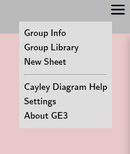
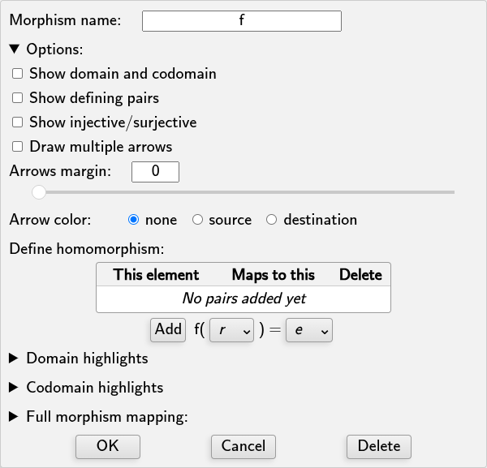
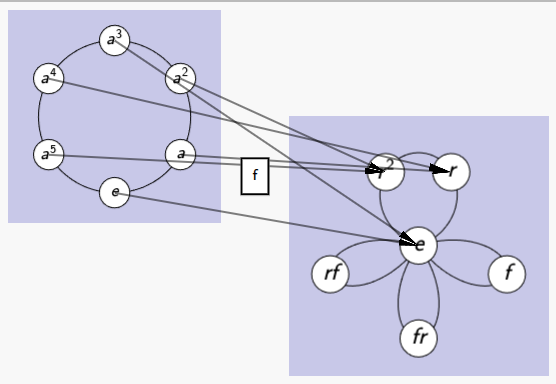
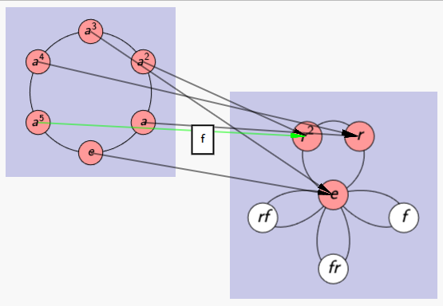
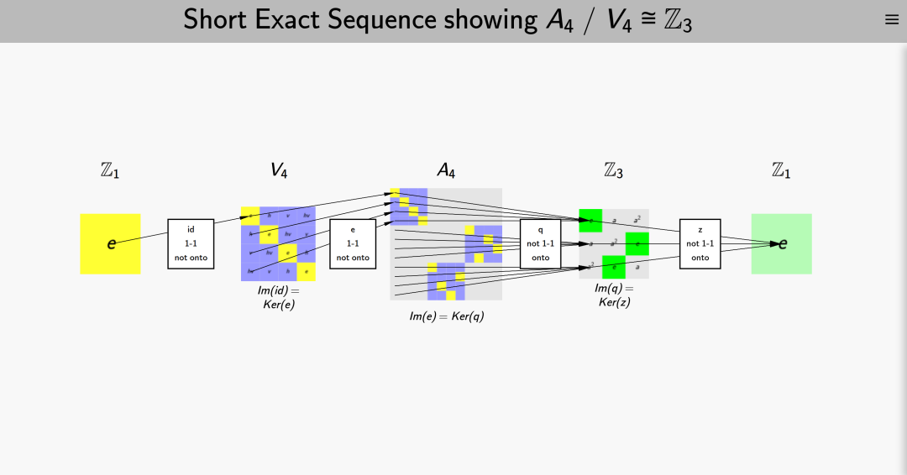
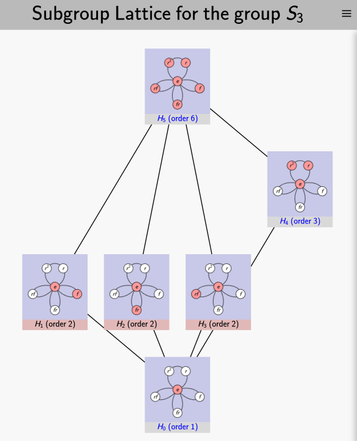
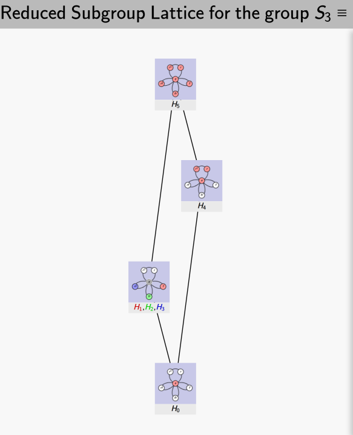
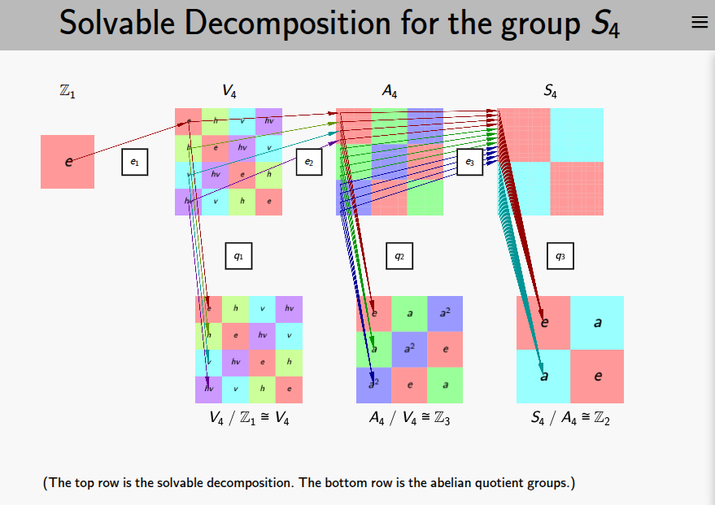

## Sheets

*Group Explorer* since version 2.0 has been able to open multiple group
visualizations in one document called a "sheet," so that they can be
compared and homomorphisms between them created, illustrated, and studied.

This page provides a quick introduction to sheets.  To go directly to the
details of the sheet interface and how to use it, [visit this page of the
User Manual](rf-um-sheetwindow.md).

Let's begin with "Making your own sheets," but you can jump down to
"[Getting Group Explorer to make sheets for
you,](#getting-group-explorer-to-make-sheets-for-you)" below, where the
fancier stuff shows up.

## Making your own sheets

Let's use a sheet to compare two groups of the same order,
[\(\mathbb{Z}_6\)](../../GroupInfo.html?groupURL=groups/Z_6.group)
and
[\(S_3\)](../../GroupInfo.html?groupURL=groups/S_3.group).

 * Select 'New Sheet' from the menu icon in the top right corner of any page:

    

    This creates a new sheet.

 * In the control window on the right hand side of the sheet, select
   \(\mathbb{Z}_6\) from the "Group" drop-down list and click the "Cycle graph"
   button below it. You should see a small cycle graph for \(\mathbb{Z}_6\)
   appear in the upper left-hand corner of the left side of the sheet. I resized
   mine slightly and the result was as follows. (To move or resize a visualizer
   first click on it with the mouse or tap it with your finger to select it.
   A light blue outline will appear around the visualizer. You can then move
   it by draggging it with your mouse or finger. And you can resize it by grabbing
   the handle in the lower right-hand corner; or you can use a scrolling gesture;
   or you can use a pinch-spread gesture. A short click [tap] anywhere
   on the screen will de-select the figure and remove the blue outline.)

 * But that's just one visualizer; we want to have at least two.  So let's
   repeat the same steps for inserting a cycle graph for \(S_3\) as well, but
   move it a little to the right of the first one, as shown below.

 * Now let's start comparing these groups.  In group theory, the means of
   examining relationships between groups is via
   [homomorphisms](rf-groupterms.md#homomorphism).  So let's create one in this
   sheet, as follows:
    * Right-click [tap] the left cycle graph element to open its context
      menu
    * Select the "Create Map" option from menu
    * Click [tap] the other cycle graph, the homomorphism target.
    * You should see a new function \(f\) appear, connecting the two graphs.
 

 * So far this isn't very informative, but if we right-click [tap] the
   morphism label box to open its context menu and select "Edit", we can do all
   sorts of interesting things. For instance, you can decide which elements from
   \(\mathbb{Z}_6\) should correspond to which elements from \(S_3\).
   Furthermore, *Group Explorer* will not let you mess this up (you cannot
   define a non-homomorphism.)  The morphism editing dialog is shown below.

 * The homomorphism defaults to the zero map (all elements map to the identity,
   in this case \(e\)) but you can change it, of course. I will map \(a\) to
   \(r\) and then check the "Draw multiple arrows" box above.  The result is the
   following illustration of one way to map \(\mathbb{Z}_6\) to \(S_3\).

The arrows require some attention to follow carefully, but you can see how the
six-element circle marches around the little three-element circle twice.  You
can highlight individual arrows by clicking [tapping] on them, as I've done with
the \(a_5 \rightarrow r_2\) mapping. (You can make it easier to select an
individual arrow by [zooming in](rf-um-sheetwindow.md#zoom-and-pan-sheet-view)
on it, especially on touch devices.) And you can highlight subsets of the group
in the visualizers. I've taken the liberty of highlighting \(\mathbb{Z}_6\) red
and its [image](rf-groupterms.md#image-of-a-subset-under-a-morphism) in \(S_3\)
red also. (To do so, either expand the highlight panel for the domain or codomain
directly in the morphism dialog, or open the context menu for the
visualizer in the sheet and select "Edit" — both give access to the same
[subset highlight controls](rf-um-subsetlistbox.md).)

This is only the beginning of the potential of sheets. The next section
shows much more.

## Getting *Group Explorer* to make sheets for you

The [group info pages](rf-um-groupwindow.md) of *Group Explorer* are full of
links that create sheets. For many common computations, it is very
interesting to be able to see the result of the computation visually. I will
whet your appetite for such illustrations by giving a few examples here, and
providing links for you to browse further yourself.

 * To see a [short exact sequence](rf-groupterms.md#short-exact-sequence) exhibiting the
   [normality](rf-groupterms.md#normal-subgroup) of a
   [subgroup](rf-groupterms.md#subgroup)
   (and the [quotient group](rf-groupterms.md#quotient-group) it computes):
    * Expand the "Subgroups" section under "Computated Properties" in the
      [group info page](rf-um-groupwindow.md#computed-properties).
    * Then find the subgroup in question on the list and follow the link
      provided.
    * The illustration below shows the normality of \(V_4\) in \(A_4\).

 * To see a [lattice of subgroups](rf-groupterms.md#lattice-of-subgroups)
   for a given group:
    * Again, expand the "Subgroups" section of the group info page.
    * Follow the link provided at the top of the resulting page,
      offering to create a sheet showing the lattice of subgroups.
    * The illustrations below show all subgroups of \(S_3\): first in
      the full lattice (each subgroup its own node), then in the reduced
      lattice (conjugate subgroups sharing a single node, color-coded by
      conjugacy class). The reduced view is most useful for larger
      non-abelian groups, where conjugacy classes can collapse many nodes
      into one; for abelian groups the two views are identical.

 * To see the [solvable decomposition](rf-groupterms.md#solvable-group-solvable-decomposition) of any
   [solvable group](rf-groupterms.md#solvable-group-solvable-decomposition):
    * Expand the "Solvable" section of the group info page.
    * The decomposition will be reported in text and you can click any of
      several links on that page to see it illustrated in various ways.
    * The illustration below shows the solvable decomposition for \(S_4\).

